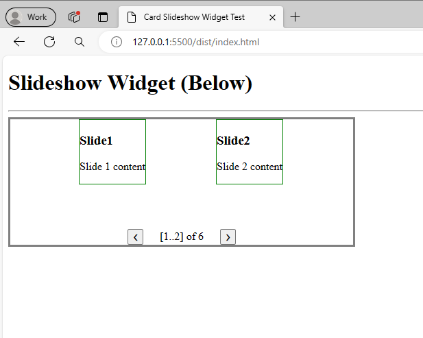
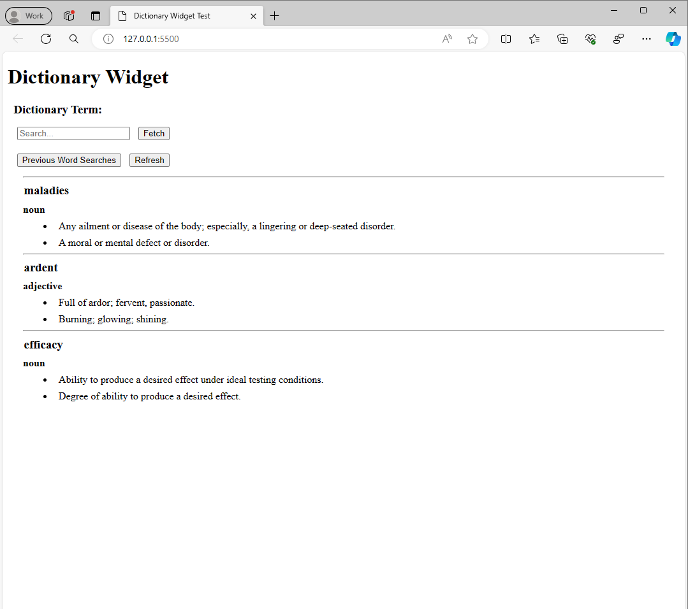
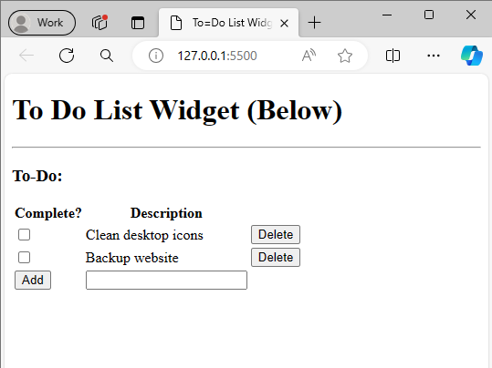
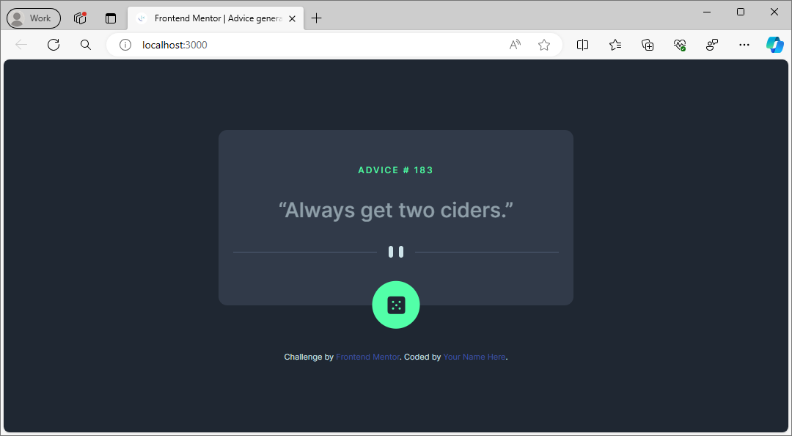

<!-- 
Copyright (c) 2026 Robert A. Howell
Author: Robert A. Howell
Description: This repository holds folders and files of multiple projects for source code demonstration. The projects are described here and in the repository subfolder README.md files, too. 
Created_Date: January 2026
Edited: 2026-01-19
-->

# Typescript Widgets
## Card Carousel  
**What is it?**  
A web component made for www.randomwebbits.com. It's a picture carousel and/or slideshow  



**What does it do?**  
- Interactive due to newly created elements and functions that are not available in the original markup
- JavaScript adds new elements to make the component function as expected
- Two slides are shown at a time, one on the left and one on the right
- The 'SlideShow' is a class with members and functions capable of running the slideshow

**Technology?**  
- Built with Gulp + TypeScript compiler
- Javascript async module
- HTML markup and JavaScript

## Dictionary Widget  
**What is it?**  
It's a search box word entry and definition retrieval program for the browser.  



**What does it do?**  
- Retrieve words from a word dictionary API
- Asynchronous word fetch
- Dynamic markup creation

**Technology?**  
- Built with Gulp + TypeScript compiler
- Javascript async module
- HTML markup and JavaScript

```TypeScript
const wordFetchRequest = async () => {

   //set apiGET::sendToBrowserCache to true to use cache storage
   const wordFetch = new apiGET(wordcache.wordURL, false, wordcache.cacheName, elem.errorElem);

   //fetch request
   let data = await wordFetch.apiGET(wordFetch.getGETURL());

   //data parse and markup render
   //...continued code...//
};
wordFetchRequest();
```

<details>
<summary>Details:</summary>

- Cached word entries in **local storage**

  > ```TypeScript
  > private addDictionaryTermtoLocalStorage(sendToBrowserCache: boolean, wordcache: localstoragewordcache, wordArray: any[],)
  > ```

- Cached responses (for offline use) in **cache storage**

  > ```TypeScript
  > //set apiGET::sendToBrowserCache to true to use cache storage
  >    const wordFetch = new apiGET(wordcache.wordURL, true, wordcache.cacheName, elem.errorElem);
  > ```

- <u>Input validation</u> with <u>interactive feedback</u>:  
  <span style="color: red">"Invalid word!"</span>  
  <span style="color: yellow">"No Definitions Found"</span>  
  <span style="color: red">"Failed to fetch, check network connection."</span>

</details>

## To-Do List Widget  
**What is it?**  
A to-do list on a webpage, made to store to-do items using stored entries  



**What does it do?**  
- Add to-dos using an input form
- Delete entries if 'complete' checkbox is entered
- Store to-dos in browser storage → re-render on page reload
- Exportable widget based on classname

**Technology?**  
- Built with Gulp + TypeScript compiler
- Javascript async module
- HTML markup and JavaScript

```HTML
<!-- Add widget to aside element -->
<h1>To Do List Widget (Below)</h1><hr>
<aside class="ToDoList"></aside>
```

- Cached entries in **local storage**

  > ```TypeScript
  > if (ToDoWidget.isToDoInStorage()){
  >    let todos: localstoragetodocache[] = JSON.parse(localStorage.getItem('ToDos')!);
  >    todos.push(ToDo);
  >    localStorage.setItem('ToDos', JSON.stringify(todos));
  > }
  > ```

## Advice Generator  
**What is it?**  
A FrontEnd Mentor challenge: it's a web component that displays colloquial advice expressions.  



**What does it do?**  
- View the optimal layout for the app depending on their device's screen size (in development: phase 1)
- See hover states for all interactive elements on the page (in development: phase 2)
- Generate a new piece of advice by clicking the dice icon

**Technology?**  
- Build with Next.js framework + TypeScript
- API
- HTML and CSS markup
